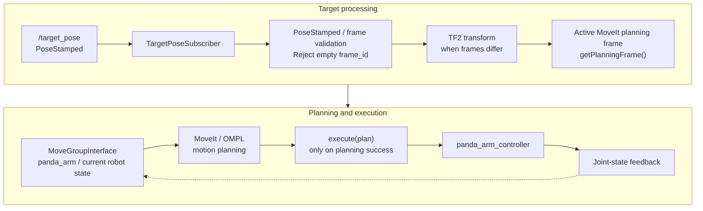

# ROS 2 / MoveIt 2 Panda Manipulation Reference Workflow

## Overview

A C++17 ROS 2 reference workflow that receives a target `PoseStamped`, resolves
it into the active MoveIt planning frame, requests collision-aware motion
planning, and executes the generated trajectory in the Franka Panda MoveIt demo.
Collision checking uses the planning scene maintained by MoveIt.

The GitHub repository is named `ros2-moveit2-panda-manipulation`; the ROS package
name remains `manipulation_core`. This is a learning and portfolio reference
workflow, with runtime validation in the Panda demo.


## Verified Runtime Example

One verified Panda demo run completed successfully with joint-state feedback:

| Measurement | Approximate elapsed time |
| --- | ---: |
| Client-side planning latency | 67.6 ms |
| Execution latency | 3198 ms |
| Total plan + execute latency | 3266 ms |

These values are from **one verified runtime test**, not benchmark averages.
Timing varies by machine, planner state, target pose, and environment.
Client-side planning latency measures the `plan()` call; execution latency
measures `execute(plan)`. Total latency covers the plan + execute workflow,
including intervening logging and handling, but excluding input validation and
TF transformation.

## Architecture



MoveIt, OMPL, controllers, and joint-state publication belong to the external
Panda demo. This package supplies the target subscriber and MoveGroupInterface
client. It does not implement a controller or directly subscribe to joint states.

## Key Features

- Subscribes to `/target_pose` with `geometry_msgs/msg/PoseStamped` and QoS depth 10.
- Rejects an empty `header.frame_id`; catches TF2 transformation failures.
- Obtains the planning frame with `getPlanningFrame()` during initialization.
  Targets already in that frame bypass transformation; other frames use TF2.
- Plans for `panda_arm` from the current robot state, with a 5-second planning
  allowance and velocity/acceleration scaling factors of 0.1.
- Calls `plan(plan)`, then `execute(plan)` on success, preserving the generated
  trajectory. Execution is skipped after planning failure; pose targets are cleared.
- Logs planning, execution, and total elapsed time using `std::chrono::steady_clock`,
  as well as transformed poses, result codes, and failures.
- Uses a two-thread `MultiThreadedExecutor` and a separate mutually exclusive
  target callback group to serialize target handling while servicing MoveIt callbacks.

The node uses the server's configured planning pipeline; it does not explicitly
select OMPL. The inspected Panda demo enables OMPL as its default pipeline.

## Environment

Verified environment:

- Ubuntu 24.04 under WSL2
- ROS 2 Jazzy
- MoveIt 2
- Franka Panda MoveIt resources (demo with mock hardware)
- C++17, required by this package's CMake target

## Dependencies

Declared by `package.xml` and `CMakeLists.txt`:

| Role | Packages |
| --- | --- |
| Build tool | `ament_cmake` |
| Build and runtime | `rclcpp`, `geometry_msgs`, `tf2`, `tf2_ros`, `tf2_geometry_msgs`, `moveit_ros_planning_interface` |
| Test/lint | `ament_lint_auto`, `ament_lint_common` |

Running the example additionally requires the external
`moveit_resources_panda_moveit_config` demo and its dependencies, including its
planning plugins, RViz, and ros2_control controllers. These are not provided by
this package. The existing CMake setup enables ament lint discovery but skips
copyright and cpplint checks; this repository has no behavioral test suite.

## Build

Place this repository at `~/ros2_ws/src/manipulation_core`. The repository root
contains `package.xml` and `CMakeLists.txt`.

```bash
cd ~/ros2_ws
source /opt/ros/jazzy/setup.bash
colcon build --packages-select manipulation_core
source install/setup.bash
```

These commands were run successfully during repository preparation. ROS package
discovery then reported `manipulation_core target_pose_subscriber`. The build
emitted an upstream `tl_expected` deprecation warning but completed successfully.

## Running

Use separate terminals, with the following environment in each:

```bash
source /opt/ros/jazzy/setup.bash
source ~/ros2_ws/install/setup.bash
```

### 1. Start the Panda MoveIt demo

```bash
ros2 launch moveit_resources_panda_moveit_config demo.launch.py
```

The installed launch file defaults to mock hardware and starts MoveIt, RViz,
the robot state publisher, ros2_control, and the Panda controllers. Wait for
the demo to initialize and for joint-state feedback before sending targets.

### 2. Start the subscriber

```bash
ros2 run manipulation_core target_pose_subscriber
```

Wait for the planning-frame and readiness log messages. The demo publishes the
robot descriptions used by MoveGroupInterface.

### 3. Publish an example target

This example is for the standard Panda demo configuration with planning frame
`world`. The recorded `panda_hand` start position was approximately
`(0.307, 0.000, 0.590)` m; the target was `(0.337, 0.000, 0.590)` m.
Both poses used the verified quaternion `(x, y, z, w) = (1.0, 0.0, 0.0, 0.0)`
in ROS xyzw order, keeping the same orientation. This represents
approximately 3 cm of positive-X end-effector displacement only from that start.
The planned path is not constrained to be a straight Cartesian line.

Confirm the current `panda_hand` pose before using this example:

```bash
ros2 run tf2_ros tf2_echo world panda_hand
```

Stop `tf2_echo` with Ctrl-C. With the demo idle, confirm that the current position
and orientation match the recorded start pose; otherwise, the absolute target
below is a different motion.

```bash
ros2 topic pub --once /target_pose geometry_msgs/msg/PoseStamped \
  "{header: {frame_id: 'world'}, pose: {position: {x: 0.337, y: 0.000, z: 0.590}, orientation: {x: 1.0, y: 0.0, z: 0.0, w: 0.0}}}"
```

The omitted stamp defaults to zero (latest available transform when TF2 is
needed). The launch command was checked against the installed demo launch file;
the executable was checked after building. Motion was not rerun during this
documentation pass. These instructions describe the author's previously
validated demo workflow, not physical robot operation.

## TF / Planning Frame Verification

In the tested Panda demo, MoveIt reported `world` as its planning frame, and
`world -> panda_link0` was an identity transform: translation `[0, 0, 0]` and
identity rotation. The inspected demo launch file also defines this static TF.
This relationship is specific to that configuration.

```bash
ros2 run tf2_ros tf2_echo world panda_link0
```

The implementation nevertheless obtains MoveIt's planning frame dynamically
and uses TF2 for input in another frame. It does not assume that `world` and
`panda_link0` always coincide.

## What I Learned / Engineering Notes

The author's runtime debugging covered ROS environment sourcing and missing
runtime dependencies, ros2_control controller readiness, `/joint_states`
availability, TF frame relationships, and MoveIt planning/execution results.
Checking these layers together helped establish that a target could be planned
and executed through the demo controller with state feedback. Separating the
planning and execution timers made their respective costs visible.

## Limitations / Future Work

- Input checks are limited: there is no explicit finite-value or unit-quaternion
  validation, workspace policy, or application-level cancellation interface.
- Targets are serialized; there is no latest-target preemption mechanism.
- Collision awareness depends on the external MoveIt planning scene; this node
  does not add obstacles or perform perception.
- Collect repeated timing samples and percentile statistics.
- Add multiple target-pose cases and automated behavioral tests.
- Experiment with collision scenes and record a visualization/demo.
- Explore future simulation integration. NVIDIA Isaac Sim, Isaac ROS, CUDA,
  and Sim-to-Real support are not implemented in this project.

## License

Apache-2.0. See [LICENSE](LICENSE); the existing license text is preserved.
